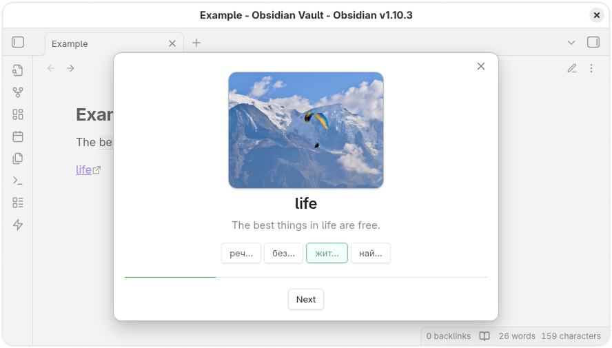

# Memodack

Forget expensive apps like [Quizlet](https://quizlet.com/), [Readlang](https://readlang.com/), and others. [Memodack](https://github.com/memodack/memodack) is a simpler, free alternative built just for memorizing language parts. Learn anytime, anywhere — offline, on mobile or desktop.

## Content

- [Installation](#installation)
- [Hotkeys](#hotkeys)
- [Syntax](#syntax)
- [Practice](#practice)
- [Settings](#settings)
  - [General](#general)
    - [Provider](#provider)
      - [Google](#google)
        - [Api Key](#api-key)
      - [Custom](#custom)
        - [Api URL](#api-url)
    - [Connection](#connection)
  - [Language](#language)
    - [Native](#native)
    - [Document](#document)
  - [Voiceover](#voiceover)
    - [Playback](#playback)
  - [Actions](#actions)
    - [Pressing](#pressing)
  - [Extra](#extra)
    - [Divider](#divider)
    - [Truncate](#truncate)
  - [Optimization](#optimization)
    - [Cache](#cache)

## Installation

1. Launch Obsidian.
2. Navigate to `Settings` > `Community Plugins`.
3. Search for `Memodack`.
4. Install and enable the plugin.

## Hotkeys

For quick translation and conversion into the plugin’s syntax, set up hotkeys for the `Memodack: Translate` command. For example, you can assign `Alt` + `T`. After that, select a word or several words and activate the shortcut.

## Syntax

The plugin uses its own syntax:

`{value|translation}`

If you want to provide multiple translations, separate them with a semicolon `;`:

`{value|translation; translation; translation}`

If you want to attach an image to a word, simply create a link to the image directly in the document, as shown in the [Example](https://github.com/memodack/memodack/blob/main/docs/example.md). This can be either a file stored in [Obsidian](https://obsidian.md/) itself or a link to an external resource.

The link name must be exactly the same as the word:

`[<value>](...)`

## Practice

To activate **Practice** mode, click the lightning icon in the left ribbon menu.

You can also select at least **4** words and then press the lightning icon to work exclusively with those words.

## Settings

Open the plugin settings.

### General

General settings are essential for translation and voiceover to function properly.

#### Provider

Providers supply translation and text-to-speech services.

##### Google

To use Google services, you need to register on **GCP** and enable the following APIs:

- [Cloud Translation API](https://console.cloud.google.com/marketplace/product/google/translate.googleapis.com)  
- [Cloud Text-to-Speech API](https://console.cloud.google.com/marketplace/product/google/texttospeech.googleapis.com)

###### Api Key

After registering in GCP, create an API Key in the [Credentials](https://console.cloud.google.com/apis/credentials) section.  
Paste it into the corresponding field in the plugin settings.

##### Custom

To connect your own **free** service, run [Translator](https://github.com/memodack/translator).

###### Api URL

Once [Translator](https://github.com/memodack/translator) is running, copy its address and paste it into the appropriate field in the plugin settings (if it is not already there).

#### Connection

After configuring the connection, press the **Check** button to test it. Notification messages will inform you of the connection status.

### Language

Configure the languages you want to work with.

#### Native

Select the language you understand.

#### Document

Choose the language of the document.

### Voiceover

Sound settings.

#### Playback

Adjust the playback speed here.

### Actions

Actions related to parts of speech.

#### Pressing

When clicking on a part of speech, you can enable voiceover.

### Extra

Additional options.

#### Divider

Translations may include multiple variants separated by `;`.  When this option is enabled, only one translation will be randomly selected.

#### Truncate

Trim part of the translation output.

### Optimization

All voiceovers are cached.

#### Cache

You can clear the cache by pressing the **Clear** button.
